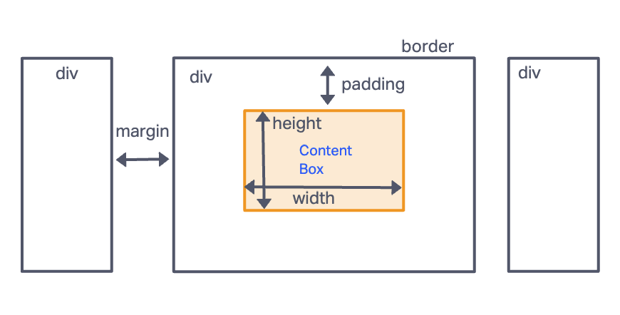

# Class 04 Lecture Notes

## CSS Box Model



## CSS Positioning

2 types of positioning

- static-type
- relative-type
  - relative
  - absolute
  - fixed

### Static
standard - element sits where it is normally

### Position Relative

Elements that are `position: relative` can be moved out of their normal flow position while still taking up the same space. This is achieved by utilising those offset properties (top, bottom, left, right) to offset the element, relative to itself.

### Position Absolute

Same as position relative, except for two key differences: The element is taken out of normal flow and leaves no space behind. The element is positioned relative to its nearest parent with a relative-type (relative, absolute, fixed) positioning.

### Position Fixed

Fixed is the same as absolute with one key difference: The element is positioned relative to the viewport.

## Functions

### What is it?

  - Reusable piece of code
  - A group of statements that perform a task or calculate a value stored in a structure that prevents them from running until the function is "called" or "invoked": `myFunction()`
    - Input --> processing --> output

### Why do we use functions?

  - reuseable
  - easier to read
  - keeps our code dry - DON'T REPEAT YOURSELF
  - efficient
  - prevents bugs and makes debugging easier
  - performs actions

### 2 step process

- Define/Declare
- Call/Invoke

```
function sayHello() {
  console.log('hello');
}

sayHello();
```

### Pair Programming Instructions

NAVIGATOR ROLE:

Direct the *driver* with the following steps:

On github.com

- Tell the driver to fork your Repository
- In GitHub, navigate the driver to THEIR COPY of the forked repo. This will have the driver's name followed by the name of the repo they forked

```
driverGitHub/repo-name
forked from navigtorGitHub/repo-name
```
- Direct the driver to copy the link from the green button that says 'code'.

In the **driver's** terminal:
- Direct the driver to cd into Projects or 201 folder and use the command `git clone` followed by the link that the driver copied from GitHub
  - This will clone down the repo on to the driver's local machine
- Direct the driver to cd into the repo and use `code .` to open VSCode

In the **driver's** terminal:
  - The navigator will instruc tthe driver to do an A-C-P and push the modified file(s) up to the **DRIVER'S COPY** of forked repo and have them click on 'Pull Requests' in the options bar across the top of the screen.
  - Below the heading that says Compare Changes, you will see a bar with two input field. One say 'base' and one says 'compare'.
  - Set base to the repo the driver FORKED FROM
  - Set compare the DRIVER'S COPY OF THE REPO
  - Push the button to 'Create the Pull Request' and follow the direction on the next screen to 'Create Pull Request'

### NAVIGATOR'S NEXT STEPS

The Navigator will then do the following on github.com:

- Go to your repository and navigate to the 'Pull Requests' in the options bar across the top of the screen.
- Click on the open 'Pull Request' that the driver initiated.
- Review the pull request and then merge the changes.

In the navigator's terminal:
- cd in to your repo and do a `git pull origin main` to pull down the accepted changes from the 'Pull Request'.
